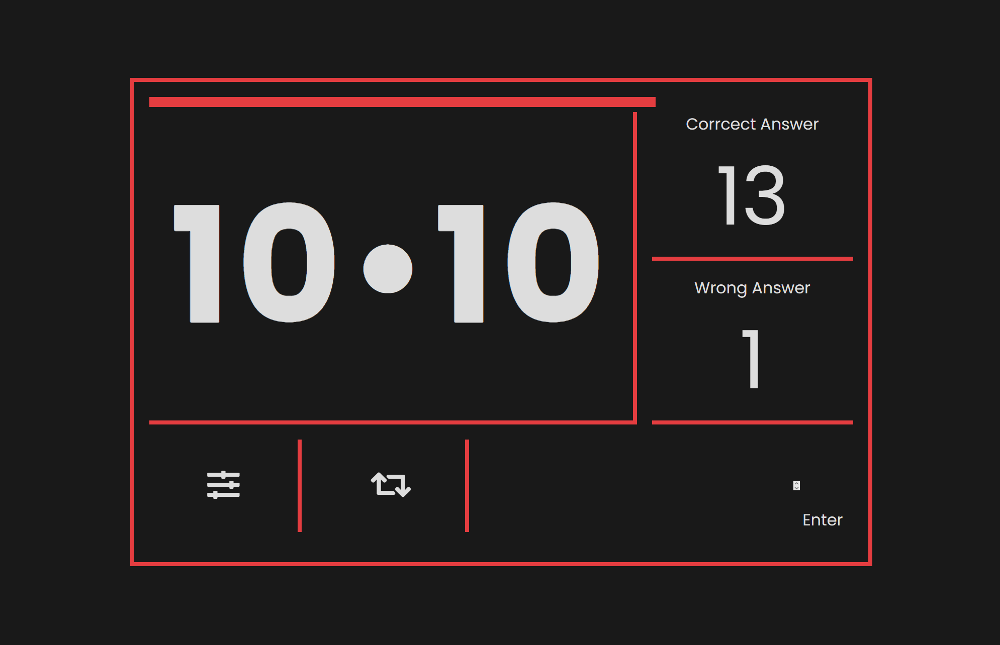

 
<h1 align="center">Multiplication for learning</h1>

&#xa0;

  <!-- <a href="https://tabliczkamnożeniadonauki.netlify.app">Demo</a> -->

  

  

  

  

  <!--  -->

  <!--  -->

  <!--  -->

<!-- Status -->

<!-- <h4 align="center">
	🚧  Tabliczka Mnożenia Do Nauki 🚀 Under construction...  🚧
</h4>

 -->

  <a href="#dart-about">About</a> &#xa0; | &#xa0; 
  <a href="#sparkles-features">Features</a> &#xa0; | &#xa0;
  <a href="#rocket-technologies">Technologies</a> &#xa0; | &#xa0;
  <a href="#white_check_mark-requirements">Requirements</a> &#xa0; | &#xa0;
  <a href="#checkered_flag-starting">Starting</a> &#xa0; | &#xa0;
  <a href="https://github.com/SeveToo" target="_blank">Author</a>

 

## :dart: About

Improve your counting skills with this simple app

## :sparkles: Features

:heavy_check_mark: You can set interval between rounds \
:heavy_check_mark: You see how many correct and wrong answers you get\

## :rocket: Technologies

The following tools were used in this project:

- HTML
- CSS
- JS

## :white_check_mark: Requirements

You just need a browser.
https://sevetoo.github.io/multiplication-for-learning/

## :checkered_flag: Starting

download the project and start **index.html**

## 😎 Made by

Made with by <a href="https://github.com/SeveToo" target="_blank">SeveTo</a>

&#xa0;

<a href="#top" style="color: #fff; background: black; padding: 15px 30px">Back to top</a>
